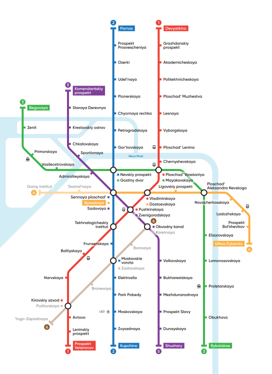
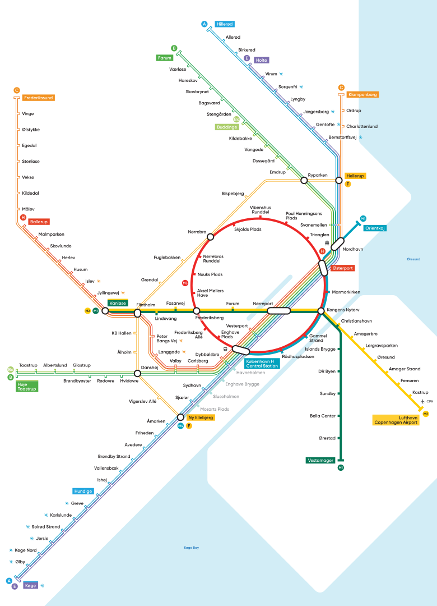
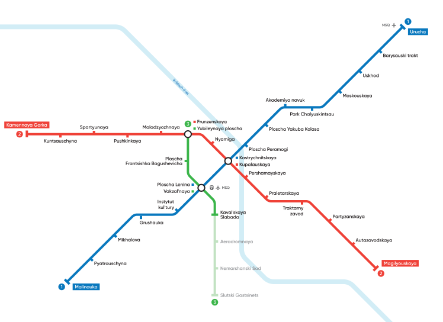

Modern metro maps
=================

Maps:

* Moscow
* St. Petersburg
* Copenhagen
* Minsk

The maps have been designed for use on various devices, but especially for mobile devices.  
It is possible to install as an application (PWA) and work without connecting to the network.  
In the design, the main goal was using of established principles and design elements. 

Maps
----

